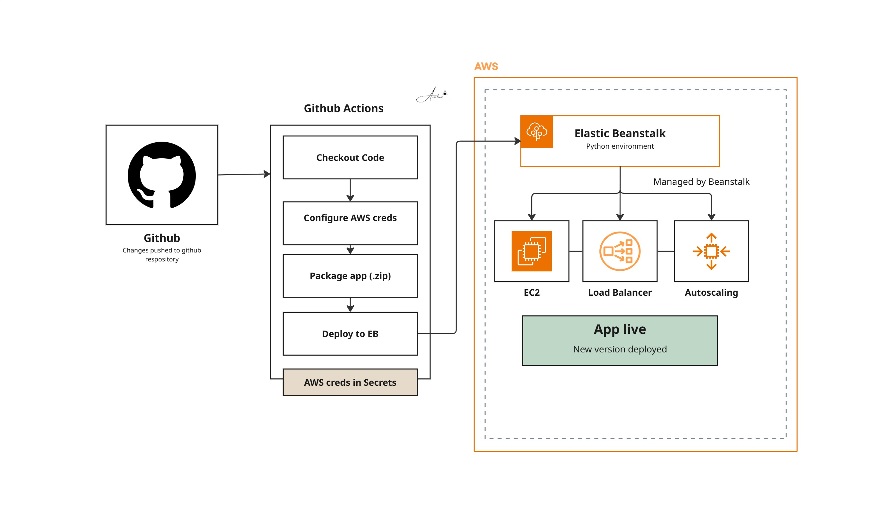

# Python Application Deployment on AWS Elastic Beanstalk


## Overview

Deployed a Python application on AWS Elastic Beanstalk and set up a GitHub Actions CI/CD pipeline that automatically deploys a new version to Elastic Beanstalk on every push to the repository. The client can now push code and see it live without any manual deployment steps.

> Note: Client code is excluded from this repository as per confidentiality agreement.

## Architecture



The deployment flow:
- **GitHub** hosts the application code
- **GitHub Actions** pipeline triggers automatically on every push
- **AWS Elastic Beanstalk** receives the new version and deploys it automatically
- Zero manual intervention required after initial setup

## Tech Stack

| Layer | Technology |
|-------|-----------|
| Language | Python |
| Platform | AWS Elastic Beanstalk |
| CI/CD | GitHub Actions |
| Trigger | Push to repository |
| Deployment | Automatic version deployment |

## What Was Built

**1. AWS Elastic Beanstalk environment**
- Created and configured an Elastic Beanstalk environment for the Python application
- Set up the platform, instance type, and environment variables

**2. GitHub Actions pipeline**
- Wrote a GitHub Actions workflow that triggers on every push to the repository
- Pipeline packages the application and deploys a new version to Elastic Beanstalk automatically
- Configured AWS credentials in GitHub Secrets for secure pipeline access

**3. Demo delivered**
- Demonstrated the full flow to the client: push code → GitHub Actions triggers → new version live on Elastic Beanstalk

## Project Structure

```
10-elasticBeanStalk-DEVOPS/
├── .github/
│   └── workflows/
│       └── deploy.yml    (GitHub Actions pipeline)
├── .ebextensions/        (Elastic Beanstalk config)
└── README.md
```

## GitHub Actions Pipeline

```yaml
on:
  push:
    branches: [main]

jobs:
  deploy:
    steps:
      - uses: actions/checkout@v3
      - name: Deploy to Elastic Beanstalk
        uses: einaregilsson/beanstalk-deploy@v21
        with:
          aws_access_key: ${{ secrets.AWS_ACCESS_KEY_ID }}
          aws_secret_key: ${{ secrets.AWS_SECRET_ACCESS_KEY }}
          application_name: your-app-name
          environment_name: your-env-name
          region: us-east-1
          version_label: ${{ github.sha }}
          deployment_package: deploy.zip
```

## Key Learnings

- Elastic Beanstalk abstracts away EC2, load balancers, and auto-scaling — you deploy the application, AWS manages the infrastructure
- GitHub Actions + Elastic Beanstalk is a clean, low-overhead CI/CD setup for Python application
- Storing AWS credentials in GitHub Secrets keeps the pipeline secure without hardcoding sensitive values